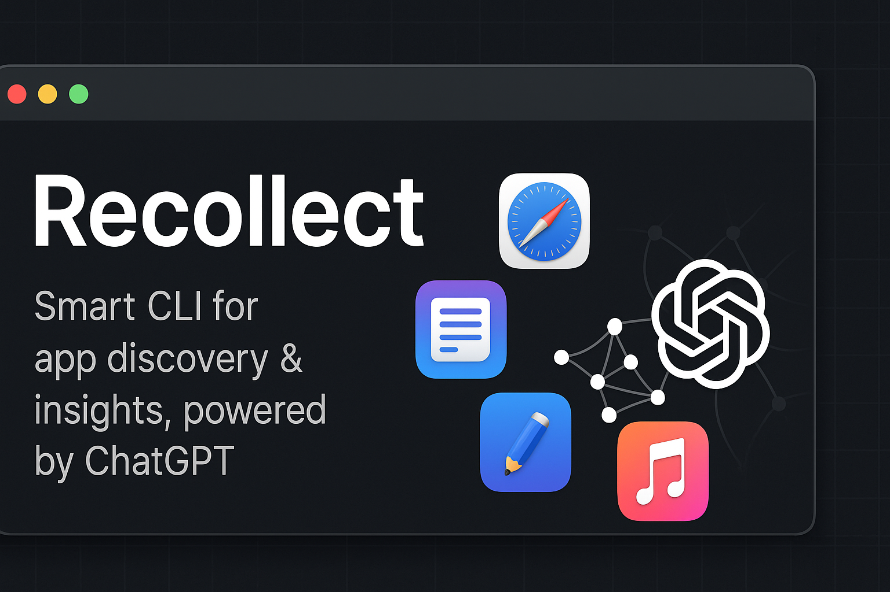

# 🖥️ Recollect: Your macOS App Finder & ChatGPT Assistant



Recollect is a smart CLI tool for macOS that scans your computer for installed applications, helps you find the right app by description, and lets you ask ChatGPT about any app on your system!

---

## ✨ Features

- **Automatic App Discovery:** Scans your `/Applications` and `~/Applications` folders for installed apps.
- **Smart App Finder:** Describe what you want (e.g., "photo editor"), and Recollect finds the best match using OpenAI's GPT models.
- **Chat with ChatGPT:** Ask questions about any app on your Mac and get instant answers.
- **App Description Caching:** Speeds up future runs by saving app descriptions locally.

---

## 🚀 Getting Started

### 1. Clone the Repository
```sh
git clone <your-repo-url>
cd recollect
```

### 2. Install Requirements
Make sure you have Python 3 and `requests` installed:
```sh
pip install requests
```

### 3. Set Your OpenAI API Key
Get your API key from [OpenAI](https://platform.openai.com/account/api-keys) and set it in your terminal:
```sh
export OPENAI_API_KEY=your_openai_api_key
```

### 4. Run the App
```sh
python3 main.py
```

---

## 🖼️ Screenshots

> Replace these with your own screenshots!


---

## 🛠️ How It Works

1. **Scan for Apps:** Finds all `.app` bundles in standard macOS locations.
2. **Describe & Match:** You describe the app you want; Recollect uses ChatGPT to match your description to the best app.
3. **Ask About Apps:** Select any app and ask ChatGPT for more info.
4. **Caching:** App descriptions are saved in `app_descriptions_cache.json` for faster future runs.


---

## 🧑‍💻 Example Output

```
Installed Applications:
1. Zoom
2. Slack
3. Chrome
...
--- App Finder by Description ---
Describe the app you are looking for (e.g., "photo editor"): voice call
Finding the best match (this may take a minute the first time)...

Best match: Zoom
Do you want to ask ChatGPT more about 'Zoom'? (y/n): y
What do you want to ask about 'Zoom'? What features does it have?
Asking ChatGPT...

ChatGPT response:
Zoom is a video conferencing application that allows users to make voice and video calls, host webinars, and collaborate online.
```

---

## 🔒 Privacy & Security
- Your OpenAI API key is never stored in the code or uploaded anywhere.
- All app scanning is done locally on your Mac.

---

## 📄 License
MIT License

---

## 🙏 Credits
- [OpenAI](https://openai.com/) for the GPT API
- [Python](https://python.org/)
- [Your Name or GitHub]

---

> _Made with ❤️ for macOS users who want to get more from their apps!_


